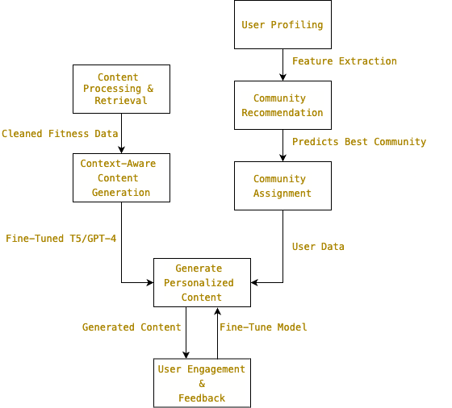

# 🧠 Context-Aware Community Generator

A generative AI-powered application that personalizes fitness engagement content based on user profiles, community context, and real-time feedback — deployed using Flask and Streamlit.

---

## 🏗️ High-Level Architecture



> This diagram outlines the modular architecture for user profiling, community assignment, and generative post creation using fine-tuned T5/GPT models. Each module is loosely coupled, allowing independent optimization and feedback integration.

---

## 🧩 System Overview

### 🔹 User Profiling
- Extracts features like age, fitness goal, experience level, and workout preferences.

### 🔹 Community Recommendation
- Uses GPT-4 (zero-shot) or BERT embeddings + scoring rules to match users to communities.

### 🔹 Context-Aware Content Generation
- T5 fine-tuned on community fitness posts; generates daily challenges, reminders, and motivational messages.

### 🔹 Feedback Loop
- Planned feedback integration for post refinement and re-ranking using user engagement.

---

## 🚀 Features
- Smart user-to-community mapping based on contextual cues.
- Daily motivational content tailored to group goals.
- Live UI using Streamlit; easily customizable via Flask APIs.
- Modular components for easy retraining or upgrading (e.g., swap T5 with LLaMA).

---

## 🛠️ Tech Stack

| Category    | Tools/Tech                          |
|-------------|--------------------------------------|
| Language    | Python                               |
| NLP Models  | GPT-4, BERT, T5 (fine-tuned)         |
| ML Tools    | PyTorch, Scikit-learn                |
| Backend     | Flask                                |
| Frontend    | Streamlit                            |
| Storage     | JSON, CSV                            |
| DevOps      | GitHub Actions (optional), Docker    |

---

## 🧪 Sample Input & Output

**Input:**
```json
{
  "age": 22,
  "goal": "muscle gain",
  "experience": "beginner",
  "preference": "gym workouts"
}
